# Authentication Flow Explained

This document visualizes how the user data is saved and retrieved between the **Client (Browser)** and the **Server (Next.js)** using Cookies.

---

## Phase 1: Logging In (Saving the User)

This is how the user data gets "saved" into the browser as a Cookie.

```mermaid
sequenceDiagram
    participant User
    participant Browser as 🌐 Client (Browser)
    participant Server as ⚡ Next.js Server (Callback Route)
    participant Supabase as 🛡️ Supabase Auth

    Note over Browser: User clicks "Login with Google"
    Browser->>Supabase: 1. Redirects to Google/Supabase
    Supabase-->>Browser: 2. Redirects back with "?code=xyz"

    Note over Browser: Browser hits /auth/callback?code=xyz (on localhost or domain)
    Browser->>Server: 3. GET /auth/callback?code=xyz

    Note right of Server: Server exchanges Code for Session
    Server->>Supabase: 4. exchangeCodeForSession(code)
    Supabase-->>Server: 5. Returns Access Token & Refresh Token

    Note right of Server: Server creates a "Set-Cookie" instruction
    Server-->>Browser: 6. Redirect to /learn (Header: Set-Cookie: token=...)

    Note over Browser: ✅ BROWSER SAVES THE COOKIE AUTOMATICALLY
```

### Key Takeaway:

You don't manually save the user. The **Server** tells the **Browser** to save the login token inside a secure HTTP Cookie via step #6.

---

## Phase 2: Visiting the Page (Reading the User)

This explains the code snippet you asked about in `app/page.tsx`:
`const { data: { user } } = await supabase.auth.getUser()`

```mermaid
sequenceDiagram
    participant Browser as 🌐 Client (Browser)
    participant Server as ⚡ Next.js Server (Page.tsx)
    participant Supabase as 🛡️ Supabase Auth

    Note over Browser: User visits "bilingualmates.com"
    Note over Browser: Browser automatically attaches the saved Cookie

    Browser->>Server: 1. GET / (Request includes Cookie)

    Note right of Server: "await createClient()" runs
    Server->>Server: 2. Reads the Cookie from the Request

    Note right of Server: "await supabase.auth.getUser()" runs
    Server->>Supabase: 3. Sends Token to verify validity
    Supabase-->>Server: 4. Returns User Data (or null if expired)

    alt User is Logged In
        Server->>Browser: 5. Redirect to /learn
    else User is Guest
        Server-->>Browser: 5. Render Landing Page
    end
```

### Key Takeaway:

When you run `getUser()` on the server:

1.  It grabs the **Cookie** that the browser sent.
2.  It asks Supabase: _"Is this cookie valid?"_
3.  Supabase replies with the **User Data**.

---

## Summary of Client vs. Server

| Feature     | Client (Browser)                               | Server (Next.js)                                |
| :---------- | :--------------------------------------------- | :---------------------------------------------- |
| **Storage** | Physically holds the **Cookie** (Encrypted).   | Does not store state. Reads Cookie per request. |
| **Action**  | Sends Cookie with every request automatically. | Validates Cookie using `getUser()`.             |
| **Code**    | `supabase-js` (Client SDK)                     | `@supabase/ssr` (Server SDK)                    |
| **Safety**  | Can't access HttpOnly cookies directly.        | Can read/write HttpOnly cookies securely.       |
